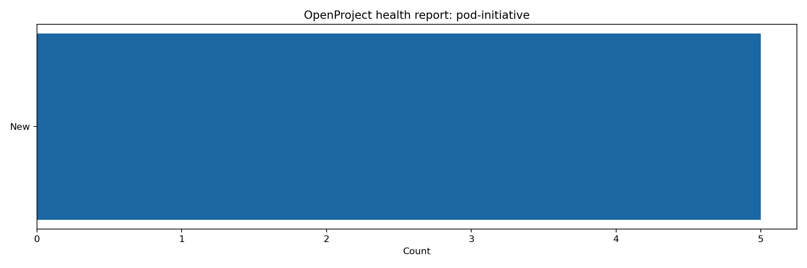

# OpenProject Codex Plugin

`openproject-codex` is a Codex plugin that lets Codex work with OpenProject directly.

Instead of switching back and forth between Codex and the OpenProject UI, you can ask Codex to:

- list projects
- inspect teams, users, and groups
- assign people to projects
- create and update work packages
- comment on work
- manage watchers
- run bulk task operations
- work with wiki pages, boards, and meetings
- generate reports and export dashboards

This plugin uses the OpenProject API where possible and falls back to authenticated OpenProject UI workflows where the public API surface is incomplete.



## Dead-Simple Setup

After installing the plugin, you can configure it directly from Codex chat.

Example:

- `@OpenProject show connection status`
- `@OpenProject setup connection with base URL https://projects.medicsprime.in and this API token ...`

The plugin now includes onboarding tools that can:

- detect missing configuration without crashing
- accept your OpenProject URL and API token from chat
- save them locally for future use
- verify the connection immediately

Useful setup prompts:

- `@OpenProject show connection status`
- `@OpenProject set up OpenProject using base URL https://projects.medicsprime.in and API token <token>`
- `@OpenProject test the current connection`
- `@OpenProject who am I in OpenProject?`

## What This Plugin Is For

Use this plugin when you want to do OpenProject work from inside Codex, such as:

- “List the projects I can access.”
- “Show my assigned work.”
- “Assign these users to the POD initiative project.”
- “Create 20 tasks and assign them to the implementation team.”
- “Comment on every item in this saved query.”
- “Generate an overdue dashboard by assignee.”
- “Export a project health report as HTML or PNG.”

## What Codex Can Do With It

### Project and workspace management

- inspect connection status
- list projects
- fetch project details
- create projects
- update projects
- delete projects

### People and team management

- list users
- fetch user details
- list groups
- fetch group details
- list roles
- list project members
- list project assignees
- create memberships
- update memberships
- delete memberships
- bulk create, update, and delete memberships

### Work package management

- list work packages
- search work packages
- fetch full work package details
- fetch raw work package payloads
- create work packages
- update work packages
- delete work packages
- add comments
- create relations
- manage watchers
- list activities, relations, watchers, attachments, and file links
- apply bulk update, comment, watcher, and delete operations
- run the same bulk action against a saved query

### Project structure and planning data

- list project versions
- list project categories
- list saved queries
- create, update, delete, and run saved queries

### Time and content modules

- list, create, update, and delete time entries
- list and update documents
- list, create, update, and delete news

### Boards, wiki, and meetings

- list boards
- create boards
- delete boards
- list wiki pages
- fetch wiki pages by slug
- create wiki pages
- update wiki pages
- delete wiki pages
- list meetings
- fetch meetings by id
- create meetings
- delete meetings

These flows use UI-backed automation where OpenProject does not expose a complete writable public API.

### Attachments and links

- upload binary attachments
- inspect attachment metadata
- delete attachments
- list and manage work package file links

### Reporting and exports

- assignee workload reports
- burndown-style snapshots from saved queries
- overdue dashboards by assignee or status
- project health export to HTML
- project health export to PNG

## How This Works In Codex

Once the plugin is installed and configured, Codex gets MCP tools from this repository.

That means you can ask for outcomes in plain language, and Codex can translate that into tool calls such as:

- `openproject_list_projects`
- `openproject_my_work`
- `openproject_create_work_package`
- `openproject_bulk_update_work_packages`
- `openproject_report_assignee_workload`
- `openproject_export_project_health`

You usually do not need to call tool names manually. In normal use, you just ask Codex what you want done.

## Example Codex Prompts

### Day-to-day work

- “List my assigned work in OpenProject.”
- “Show open tasks in `pod-initiative` assigned to me.”
- “Create a task called `Prepare API handoff` in `pod-initiative`.”
- “Add a comment to work package `1234` saying testing is complete.”

### Team and project coordination

- “List the members of `pod-initiative`.”
- “Add user `20` to `pod-initiative` as `Member`.”
- “Assign all tasks in this query to user `20`.”
- “Bulk add a watcher to all tasks in this saved query.”

### Reporting

- “Show me assignee workload for `pod-initiative`.”
- “Generate a burndown for query `131`.”
- “Build a dashboard of overdue tasks by team.”
- “Export project health charts as PNG.”
- “Export project health charts as HTML.”

### Content and planning

- “Create a wiki page for the POD kickoff checklist.”
- “List project meetings.”
- “Create a meeting for tomorrow at 10:00.”
- “Create a board for POD initiative tracking.”

## Installation

### Recommended: Use as a Custom MCP Server

This is the recommended setup for teams because it is the most reliable path in Codex.

Start here:

1. Clone the repository to your machine.
2. In Codex, choose `Plugins` -> `Connect to a custom MCP`.
3. Point Codex to the local `scripts/openproject_mcp.py` file.
4. Configure OpenProject in chat by pasting your own token.

#### Step 1: Clone the repository

Clone the repo anywhere you like. These are the recommended locations:

- macOS/Linux: `~/Documents/GitHub/openproject-codex-plugin`
- Windows: `C:\Users\<your-user>\Documents\GitHub\openproject-codex-plugin`

Clone command:

```bash
git clone https://github.com/varaprasadreddy9676/openproject-codex-plugin.git
```

#### Step 2: Connect it in Codex

In Codex:

1. Open `Plugins`.
2. Click `Connect to a custom MCP`.
3. Choose `STDIO`.
4. Fill the form like this.

macOS/Linux:

- `Name`: `OpenProject Codex`
- `Command to launch`: `python3`
- `Arguments`: `/absolute/path/to/openproject-codex-plugin/scripts/openproject_mcp.py`

Windows:

- `Name`: `OpenProject Codex`
- `Command to launch`: `python`
- `Arguments`: `C:\absolute\path\to\openproject-codex-plugin\scripts\openproject_mcp.py`

Examples:

- macOS: `/Users/sai/Documents/GitHub/openproject-codex-plugin/scripts/openproject_mcp.py`
- Linux: `/home/alex/Documents/GitHub/openproject-codex-plugin/scripts/openproject_mcp.py`
- Windows: `C:\Users\Alex\Documents\GitHub\openproject-codex-plugin\scripts\openproject_mcp.py`

Optional environment variable:

- `OPENPROJECT_BASE_URL = https://projects.medicsprime.in`

You can also leave environment variables empty and configure the connection fully in chat.

#### Step 3: Configure it in chat

After connecting the MCP server, open a new Codex thread and say:

- `show OpenProject connection status`
- `set up OpenProject using base URL https://projects.medicsprime.in and API token <your-token>`

Then use it normally:

- `list my OpenProject projects`
- `show my assigned work`
- `create a task in pod-initiative`

Important:

- Each user should use their own OpenProject API token.
- The path to `scripts/openproject_mcp.py` is different for each person because it depends on where they cloned the repo.
- What stays the same is the repo name and the file path inside it:
  `openproject-codex-plugin/scripts/openproject_mcp.py`

### Optional: Install through the Codex Plugin UI

Use this only if you specifically want the plugin marketplace flow.

The marketplace is self-contained under `.agents/plugins`, so you only need one sparse path.

In Codex:

1. Open `Plugins`.
2. Click `+` then `Add plugin marketplace`.
3. Use:

```text
Source: https://github.com/varaprasadreddy9676/openproject-codex-plugin.git
Git ref: main
Sparse paths: .agents/plugins
```

4. Add the marketplace.
5. Install `OpenProject Codex` from that marketplace.

Important:

- Do not point the marketplace dialog at `plugins/codex` or the repo root without the marketplace path.
- This repository exposes a self-contained Codex marketplace at `.agents/plugins/marketplace.json`.
- You do not need a second sparse path for `plugins/openproject-codex`.
- If you added an older copy of this marketplace before June 29, 2026, remove it and add it again so Codex fetches the self-contained layout.

### Local Development Setup

### 1. Clone the repository

```bash
git clone https://github.com/varaprasadreddy9676/openproject-codex-plugin.git
cd openproject-codex-plugin
```

### 2. Install Python dependencies

```bash
python3 -m pip install -e .
```

If you install through the Codex marketplace, the plugin now starts without a first-run dependency install. A manual `pip install` is still useful for local development, but it is not required just to connect the plugin in Codex.

### 3. Configure the MCP server for Codex manually

Create or update `.mcp.json`:

```json
{
  "mcpServers": {
    "openproject_codex": {
      "command": "python3",
      "args": ["./scripts/openproject_mcp.py"],
      "cwd": ".",
      "env": {
        "OPENPROJECT_BASE_URL": "https://your-openproject.example.com",
        "OPENPROJECT_DEFAULT_PROJECT": "",
        "OPENPROJECT_API_TOKEN_FILE": "~/.codex/secrets/openproject-api-token"
      }
    }
  }
}
```

### 4. Add credentials

Minimum API configuration:

- `OPENPROJECT_BASE_URL`
- `OPENPROJECT_API_TOKEN` or `OPENPROJECT_API_TOKEN_FILE`

Optional legacy fallback:

- `OPENPROJECT_BASIC_API_TOKEN`
- `OPENPROJECT_BASIC_API_TOKEN_FILE`

Needed for UI-backed boards, wiki, and meeting tools:

- `OPENPROJECT_UI_USERNAME`
- `OPENPROJECT_UI_PASSWORD`

Or file-backed equivalents:

- `OPENPROJECT_UI_USERNAME_FILE`
- `OPENPROJECT_UI_PASSWORD_FILE`

You can also skip manual environment setup and configure the plugin from Codex chat through:

- `openproject_setup_connection`
- `openproject_connection_status`
- `openproject_test_connection`
- `openproject_clear_saved_connection`
- `openproject_whoami`

## Recommended Secret Setup

Example:

```bash
mkdir -p ~/.codex/secrets
printf '%s' 'your-openproject-api-token' > ~/.codex/secrets/openproject-api-token
printf '%s' 'your-openproject-username' > ~/.codex/secrets/openproject-ui-username
printf '%s' 'your-openproject-password' > ~/.codex/secrets/openproject-ui-password
chmod 600 ~/.codex/secrets/openproject-*
```

Then point `.mcp.json` at those files through environment variables.

## Using It In Codex

After the plugin is configured, restart or reload Codex so it picks up the MCP server.

From there:

1. Open a Codex thread.
2. Ask for the OpenProject task in plain English.
3. Codex will call the plugin tools behind the scenes.

Examples:

- “Use OpenProject and list the projects I can access.”
- “Use OpenProject and show my assigned tasks.”
- “Use OpenProject and export a project health report for `pod-initiative` as HTML.”

If the request maps to a tool the plugin exposes, Codex can do it directly.

For first-time setup, you can do this directly in chat instead of editing files:

1. Ask Codex to show OpenProject connection status.
2. If setup is missing, ask Codex to configure OpenProject with your base URL and API token.
3. Ask Codex to test the connection.
4. Start using normal project-management prompts.

## Tooling Notes

### Generic API access

If a specific OpenProject endpoint is not yet wrapped as a dedicated tool, Codex can still use:

- `openproject_call_api`

That makes it possible to hit other `/api/v3/...` endpoints without waiting for a first-class wrapper.

### Work package custom fields

Some OpenProject instances require extra custom fields on create or update.

For those cases, the work package tools support:

- `field_overrides`
- `link_overrides`

Use those to pass instance-specific fields without changing plugin code.

## Local Verification

### Read-only smoke test

```bash
python3 ./scripts/smoke_test.py
```

This validates:

- API connectivity
- project listing
- role listing
- user listing
- group listing
- “my work” retrieval

### Live write smoke test

```bash
OPENPROJECT_SMOKE_WRITE=1 python3 ./scripts/smoke_test.py
```

This creates and removes disposable test artifacts for:

- boards
- wiki pages
- meetings
- wiki and meeting attachments

### Optional work package bulk smoke

```bash
OPENPROJECT_SMOKE_WRITE=1 OPENPROJECT_SMOKE_WORK_PACKAGE_BULK=1 python3 ./scripts/smoke_test.py
```

If your instance requires a specific custom option when creating work packages, set:

```bash
OPENPROJECT_SMOKE_CUSTOM_OPTION_HREF=/api/v3/custom_options/21
```

## Reporting Examples

These are direct tool examples that Codex can use:

- `openproject_report_assignee_workload(project="pod-initiative")`
- `openproject_report_burndown(query_id=123)`
- `openproject_dashboard_overdue_by_team(project="pod-initiative")`
- `openproject_export_project_health(project="pod-initiative", file_format="html")`
- `openproject_export_project_health(project="pod-initiative", file_format="png")`

## Current Limits

- Board card and column manipulation is not yet wrapped as a first-class tool surface.
- Meeting editing beyond create/delete is not yet first-class.
- Some OpenProject instances expose project-scoped query routes differently; global query access is more reliable across instances.
- Instance-specific permissions may still block destructive operations even when read and update access works.

## Why This Plugin Exists

OpenProject has an official `/mcp` endpoint, but in practice the writable surface is still limited for many real workflows.

This plugin exists so teams can do real project operations from Codex now:

- operational work
- bulk work
- reporting
- dashboard export
- project coordination

without treating Codex as read-only.

## Repository Structure

- `.agents/plugins/marketplace.json` repo-level Codex marketplace manifest
- `.agents/plugins/plugins/openproject-codex/` self-contained installable plugin bundle used by the marketplace
- `plugins/openproject-codex/` local development copy of the plugin bundle
- `plugins/openproject-codex/.codex-plugin/plugin.json` plugin metadata
- `plugins/openproject-codex/.mcp.json` MCP server wiring example
- `plugins/openproject-codex/scripts/openproject_mcp.py` MCP server implementation
- `plugins/openproject-codex/scripts/smoke_test.py` verification script
- `plugins/openproject-codex/skills/openproject-codex/SKILL.md` Codex skill guidance
- `.codex-plugin/plugin.json` root plugin manifest kept for direct local development compatibility

## License

MIT
